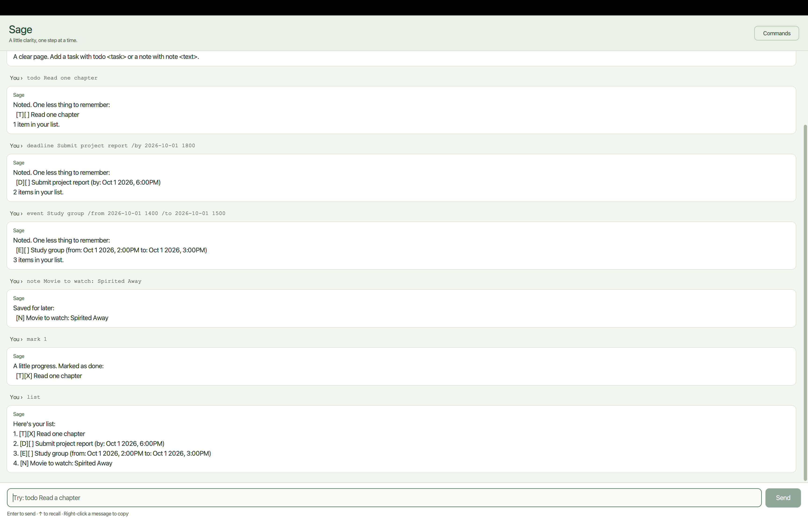

# Sage User Guide

*A little clarity, one step at a time.*

Sage is a desktop companion for tasks, deadlines, events, and small things worth remembering.
Type short commands into a calm, compact chat window. Sage keeps your list on your computer
and brings it back when you reopen the app from the same folder.



## On this page

- [Quick start](#quick-start)
- [Getting around](#getting-around)
- [Command reference](#command-reference)
- [Dates and times](#dates-and-times)
- [Saving and backing up your data](#saving-and-backing-up-your-data)
- [Troubleshooting](#troubleshooting)
- [Frequently asked questions](#frequently-asked-questions)

## Quick start

### 1. Check the requirements

Install **Java 25** and use a desktop environment with a graphical display.
Check the installed version in a terminal:

```sh
java -version
```

On macOS, use the [Java distribution recommended by SE-EDU](https://se-education.org/guides/tutorials/javaInstallationMac.html).
Choose a Sage build that matches your computer and Java runtime:

| Computer | Build to obtain |
| --- | --- |
| Windows x64, Linux x64, or Intel Mac | Build with Intel macOS libraries (`macArm64=false`) |
| Apple Silicon Mac with ARM64 Java | Build with Apple Silicon libraries (`macArm64=true`) |

The committed build produces `sage.jar` for the Intel macOS variant and `sage-mac-arm64.jar` for
the ARM64 macOS variant. Check the release description if a supplier has renamed the file.
32-bit Java, ARM Windows, and ARM Linux are not supported release targets.

### 2. Obtain and launch Sage

Check the project's [Releases page](https://github.com/codeforce233/ip/releases) for a suitable JAR.
If a release is not available, obtain a build from the project maintainer.

1. Put `sage.jar` in a folder where you have permission to create files.
2. Open a terminal in that folder.
3. Start Sage:

   ```sh
   java -jar sage.jar
   ```

Keep launching Sage from this same folder so it can find your saved list.
If you downloaded `sage-mac-arm64.jar`, substitute that filename in the launch command.
The JAR includes JavaFX dependencies; you do not need the source code or an IDE to run it.
Java itself must still be installed.

### 3. Try your first commands

Type each command separately and press **Enter**:

```text
todo Read one chapter
note Movie to watch: Spirited Away
list
```

Sage shows the task and note in one numbered list. To complete the first task, enter `mark 1`.
To exit, enter `bye` or close the window.

## Getting around

- **Command input:** type at the bottom of the window. Press Enter or click **Send**.
- **Commands:** opens a compact reference; **Hide help** closes it again.
- **Conversation:** your commands appear as compact rows; Sage's replies use wider cards.
- **Errors:** a card labelled **Needs your attention** explains what to fix. Failed input stays
  selected so you can replace it immediately.
- **Recall:** press the Up arrow when the input is empty to recall the previous command.
- **Copy:** right-click a message and choose **Copy message**.
- **Resize:** resize the window to suit your screen. Long replies wrap, and the conversation scrolls.

Blank commands cannot be sent from the GUI. A successful command clears the input.


### Reading your list

| Marker | Meaning |
| --- | --- |
| `[T]` | A task without a date |
| `[D]` | A deadline |
| `[E]` | An event with a start and end |
| `[N]` | A note |
| `[ ]` | A task not yet completed |
| `[X]` | A completed task |

For example, `1. [T][X] Read one chapter` means entry 1 is a completed task.
Notes do not have a completion marker.

## Command reference

Command names are **lowercase**. Replace text inside `<angle brackets>` with your information;
do not type the brackets. Enter one command per line. Extra spaces around a command, or between
its name and its arguments, are accepted.

| Action | Format |
| --- | --- |
| Add a task | `todo <description>` |
| Add a deadline | `deadline <description> /by <time>` |
| Add an event | `event <description> /from <start> /to <end>` |
| Save a note | `note <text>` |
| Show all entries | `list` |
| Find entries | `find <keyword or phrase>` |
| Complete a task | `mark <number>` |
| Reopen a task | `unmark <number>` |
| Remove an entry | `delete <number>` |
| Close Sage | `bye` |

`list` and `bye` take no extra arguments. The list holds up to **100 entries**, including notes.
New entries with matching details are rejected even if the existing task is complete; comparison
ignores letter case and repeated spaces. Deadlines and events also compare their time details.

### Add a task: `todo`

Use a task for something that does not need a date.

```text
todo Read one chapter
```

In a new list, Sage replies:

```text
Noted. One less thing to remember:
  [T][ ] Read one chapter
1 item in your list.
```

The description cannot be empty. Adding a task saves it immediately.

### Add a deadline: `deadline`

```text
deadline Submit project report /by 2026-10-01 1800
```

The saved entry appears as:

```text
[D][ ] Submit project report (by: Oct 1 2026, 6:00PM)
```

Include a description and one `/by` parameter followed by a nonempty time.
Use whitespace around `/by`; `/by2026-10-01` is not a valid parameter.

### Add an event: `event`

```text
event Study group /from 2026-10-01 1400 /to 2026-10-01 1500
```

```text
[E][ ] Study group (from: Oct 1 2026, 2:00PM to: Oct 1 2026, 3:00PM)
```

Include `/from` and `/to` exactly once, in that order, with both values present.
When both values are recognised dates, the end must be **strictly later** than the start.
An event with equal start and end times is rejected.

### Save a note: `note`

Notes are small, single-line snippets rather than tasks to complete.

```text
note Movie to watch: Spirited Away
```

```text
Saved for later:
  [N] Movie to watch: Spirited Away
```

You can list, find, and delete notes, but cannot mark or unmark them.
Unicode, pipes (`|`), and backslashes are retained when saved and reopened.
Empty notes are rejected. Notes share the same 100-entry limit as tasks.

### View all entries: `list`

```text
list
```

Sage displays every task and note in list order, including completed tasks.
An empty list shows a suggestion for adding your first item.

### Find entries: `find`

```text
find report
```

Search matches text inside task descriptions and notes, ignoring letter case.
For example, `find REPORT` also matches `Submit project report`.
A multiword phrase is matched as a phrase, not as separate search terms.
The search does not match an entry solely by its date or completion marker.

Search results retain their **original list numbers**. If the report is entry 2, it remains
number 2 in the results. You can then use `mark 2` on that task.

### Complete or reopen a task: `mark` and `unmark`

```text
mark 1
unmark 1
```

`mark` changes the task's marker from `[ ]` to `[X]`; `unmark` changes it back.
Use the current number of a task, deadline, or event—not a note.

### Remove an entry: `delete`

```text
delete 2
```

Entry 2 is removed and the change is saved. Remaining entries are renumbered.
Use `list` again before another numbered command if you are unsure of the new positions.

> Deletion has no undo command. Check the entry number first and keep backups of important data.

### Exit: `bye`

```text
bye
```

Sage shows a farewell and closes the GUI shortly afterwards. The window's close button also works.
Successful changes are saved as you make them; there is no separate save command.

## Dates and times

Use a real calendar date and, optionally, a 24-hour time:

| Format | Example |
| --- | --- |
| `yyyy-MM-dd` | `2026-10-01` |
| `d/M/yyyy` | `1/10/2026` |
| Either date format followed by `HHmm` | `2026-10-01 1800` |
| Either date format followed by `HH:mm` | `1/10/2026 18:00` |

Spaces or tabs between a numeric date and its time are accepted. Impossible numeric dates such
as `2026-02-30`, and invalid times such as `25:00`, are rejected instead of silently adjusted.
Dates without a time are interpreted as midnight. Midnight is displayed without a time label.
Dates are displayed in English regardless of the operating system's language.

Natural-language text such as `Sunday` or `Mon 2pm` is also accepted and displayed as entered:

```text
deadline Return library book /by Sunday
```

**This text is a label, not a reminder or a parsed date.** Sage cannot reliably compare event
times if either value is natural-language text. Use numeric dates for range validation.
There are no notifications, alarms, or calendar integrations.

## Saving and backing up your data

Sage stores entries in `data/sage.txt`, relative to the folder from which you launch the program.
The file is created on the first successful change; a missing file on a fresh installation is normal.

To back up or move your list:

1. Close Sage.
2. Copy the `data` folder to a safe location, or alongside the JAR in its new launch folder.
3. Reopen Sage from the intended folder and run `list` to check your entries.

The file is plain text, not encrypted. Avoid storing passwords or other secrets.
Do not edit it while Sage is running, or run two copies of Sage against the same file.
Chat history itself is not saved; your entries are.

If existing data cannot be read, Sage warns you and blocks changes to protect the original file.
A failed save reports an error and rolls back the attempted change in memory.
Keep backups: these protections do not replace them.

## Troubleshooting

| Problem | What to do |
| --- | --- |
| Unknown command | Use a lowercase command from the reference. `todo` and `note` are complete command names, not prefixes for longer words. |
| Missing description, text, or number | Supply the required argument, for example `todo Read chapter` or `mark 1`. |
| Deadline or event format error | Check spaces around `/by`, `/from`, and `/to`; use each required parameter once. |
| Invalid task number | Run `list`, then use a positive whole number shown in the current list. |
| A note cannot be marked | Notes have no completed state. Keep the note or remove it with `delete`. |
| Duplicate entry | Use `list` or `find` to locate it. Completion does not make an otherwise identical task distinct. |
| List is full | The limit is 100 tasks and notes combined. Back up your data and delete unneeded entries. |
| Saved data cannot be read | Close Sage, back up the file, check its contents and permissions, and restart after fixing it. Do not discard the original just to remove the warning. |
| A change cannot be saved | Check write permission for the launch folder and available disk space. The attempted change has not been applied; retry after fixing the cause. |
| Previous entries appear missing | Launch from the same folder as before. Sage may be looking at a different `data/sage.txt`. |
| Java version error | Confirm `java -version` shows Java 25 and the terminal uses the intended installation. |
| Native-library or GUI startup error | Check the build's macOS architecture and Java architecture. Linux needs a desktop display and GTK libraries. Ask the project maintainer for a compatible build if needed. |


## Frequently asked questions

**Can I edit an entry or undo deletion?**

There is no edit or undo command. Record the corrected version, check it, and remove the old
entry using its current number.

**Does marking a task remove it?**

No. It remains in the list with `[X]` until you delete it.

**Does Sage need an internet connection?**

The app manages local files and does not require an online account. Downloading Java, obtaining
a release, or building dependencies may need internet access.

**Can I use Sage without the GUI?**

Run `java -cp sage.jar sage.Sage` from the launch folder. It uses the same commands and data file.
Do not run it alongside the GUI against that file.

---

[Source code and issues](https://github.com/codeforce233/ip)
